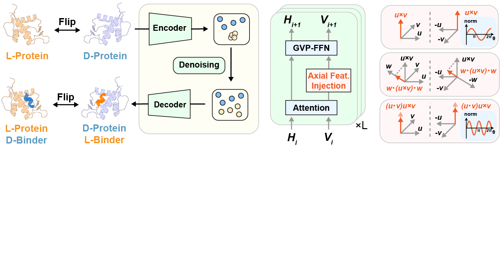

😊 Hi, this is **PepMirror**, a generative model for designed mirror-image D peptide binders towards protein targets. By constructing axial features and let them interact with polar features, we help the transformers to better understand the difference between different chirality, while preserves stable representations between enantiomers, enabling the stable homo-chiral generation and hetero-chiral interface design.

## 📋 Installation

First, clone this repo:

```bash
git clone https://github.com/YZY010418/PepMirror.git --depth 1
```

Then create an environment, we recommand you to use mamba to accelarate the process.

```bash
conda install -n base -c conda-forge mamba -y

mamba env create -f environment..yaml --channel-priority flexible
conda activate PepMirror
```

If you want to use our pre-trained weights for generation, please download the corresponding ckpt and save them in `./checkpoints`. Generally speaking, we suggest to use the *commutator* as axial features in *both* GNN and FFN.

```bash
mkdir -p checkpoints
wget 'https://zenodo.org/api/records/20095187/files-archive' -O ./checkpoints/checkpoints.zip
unzip ./checkpoints/checkpoints.zip -d ./checkpoints/
```

If you want to replicate our ranking protocol, you may also install the following tools and packages.

```bash
# Activate the PepMirror environment first
conda activate PepMirror

# Install FreeSASA, PLIP, AutoDock Vina, APBS, and MGLtools
mamba install -y -c conda-forge freesasa plip vina apbs --channel-priority flexible
mamba install -y -c bioconda mgltools

# To avoid mgltools hack the python version
ln -sf $CONDA_PREFIX/bin/python3.9 $CONDA_PREFIX/bin/python

# Install PyRosetta installer
pip install pyrosetta-installer

# Install PyRosetta
python -c 'import pyrosetta_installer; pyrosetta_installer.install_pyrosetta(mirror=0)'
```
If the PyRosetta download is slow, try using different mirror

```bash
python -c 'import pyrosetta_installer; pyrosetta_installer.install_pyrosetta(mirror=1)'
```

Or maybe download to local from the website [https://graylab.jhu.edu/download/PyRosetta4/archive/release-quarterly/release/](https://graylab.jhu.edu/download/PyRosetta4/archive/release-quarterly/release/), and upload to the HPC, and then install it

```bash
conda activate CPMirror
pip install /hpc-cache-pfs/home/yangziyi/pyrosetta-*.whl
```
## 🚀 Quick Start

### Generation

PepMirror is a target based model that takes a pocket as input and outputs a cyclic peptide binder, where the pocket is designated by a reference binder. 

Parameters and conditions are specified in a yaml file, with an example shown as below:

```yaml
dataset: 
  pdb_paths:
    - ./target.pdb # the path to the target PDB
  tgt_chains:
    - R # receptor chain, can use the format of ABC to set multiple chains as receptor
  lig_chains:
    - L # ligand chain, used for define the binding pocket
templates:
  - class: LinearPeptide
    size_min: 10 # the length is [size_min, size_max)
    size_max: 17 # the model is reliable for length within the training distribution of [4,25]

batch_size: 50 # how many structures to generate for one run, the CUDA memory constraints this
n_samples: 100 # how many designs we want in total
```

Then we can run generation by:

```bash
python -m api.generate --config path/to/config.yaml --save_dir path/to/output/dir --gpu 0 --ckpt ./checkpoints/pepmirror_cross_both_v1.ckpt 
```

***If you don't have a reference binder*** (only a receptor structure), we suggest you to mannually add an atom with an atom name of CB, such as:

```text
ATOM    117  CB  CEN L  89      98.937 124.782 150.267  1.00117.59      A    C  
```

The model will define pockets based on the 10A radius ball around this atom. We recommand you to first generate about 10 designs using this virtual atom center, and select one designed complex as the input for larger-scale generation, in order to align with a pocket shape of peptides, and avoid missing possible interaction residues.


***For setting axial feature configurations***, you may specify the type of axial features and the position where axial features are introduced by setting

```yaml
axial_type: cross # choose from cross, triple_projection, commutator, triple_scalar, cross_triple_projection_commutator, and Polar if you don't want to inject axial features
axial_position: Both # choose from Both, GNN, and FFN
```

or using the `--ckpt` argument to specify a checkpoint for certain configuration.

* Although there are many combinations of the axial type and position, only 7 of them have pretrained weights, as shown below.
* You may set `checkpoint_dir: ./checkpoints_dir` if the path of the checkpoint dir is not the default path `./checkpoints_dir`.
* By setting `--ckpt` in the `api.generate`, you may appoint a new checkpoint file for generation.

|                                    | Both | GNN | FFN |
| ---------------------------------- | ---- | --- | --- |
| cross                              | ✓    |     |     |
| triple_projection                  | ✓    |     |     |
| triple_scalar                      | ✓    | ✓   |     |
| commutator                         | ✓    | ✓   |     |
| cross_triple_projection_commutator | ✓    |     |     |
| polar                              | --   | --  | --  |

***For D-peptide binder design***, what we do is to first get the enantiomer of the target, generate designs consist of L-residues torwards this enantiomer, and get the enantiomer of the resulting complexes. The process can be done by:

```bash
python scripts/mirror_pdb.py -i pdbs_L -o pdbs_D
python -m api.generate --config path/to/config.yaml --save_dir path/to/output/dir --gpu 0
python scripts/mirror_pdb.py -i path/to/output/PDB/dir -o output_pdb_mirror_back -j 8
```

* The input and output can either be a single PDB file or a directory of PDB
* By default the chirality conversion is based on central inversion, while you can also choose to do this by mirror relections by setting `--mode x/y/z/random`.
* You may set `--recursive` to detect all PDB files in the input directory, and `--seed SEED` when you want a random plane to serve as the reflection plane.

### Post-Processing and Ranking

**First**, if you want to clean the generation and get rid of designs with mixed chirality:

```bash 
python scripts/filter_chirality.py -i pdb_dir --chirality D -c A --remove_failed
```

* replace `--remove_failed` to `--failed failed_dir` so that the failed designs will not be deleted, but will be moved to the failed_dir instead.

**Second**, you may run the minimization for the designs based on the amber ff14sb forcefield.

```bash
# To ensure using single-thread cpu
export OPENMM_CPU_THREADS=1
export CUDA_VISIBLE_DEVICES=
python scripts/openmm_relaxer_mp.py {path/to/raw/structures} {path/for/minimized/structures} --nproc {number_of_protocols} --platform CPU
```
* if you want to use GPU for minimization, you may ignore the first two commands and change to `--platform CUDA`
* the relaxer removes all HETATM by default, if you want to remain these atoms, add `--include_het` in the command

**Finally**, for scoring and ranking, we would like to highlight that *in silico* ranking is still a hard question without a well-accepted answer. We provide a protocol that looks good from our viewpoints, but the correlation between these metrics and affinity has not been systematically evaluated.

We provide a one-shot evaluation script:

```bash
python evaluation/rank.py \
  -i relaxed_pdb_dir \
  -o results.csv \
  --receptor_chain R \
  --ligand_chain L \
  -p num_processors \
```

This will generate a csv file that contains some metrics we used for ranking. Our protocol is to first filter out implausible designs by thresholds including:

* absBSA > 400
* relBSA > 0.20 and relBSA < 0.85
* vina score < -4.0
* sc (shape complementary) > 0.65
* ec (electrostatic complementary) > 0.65
* buried_Hbonds < 10
* num(interaction) > 8
* num(H_bonds) > 3

Then we calculate Z_scores of `num(mainchain_Hbonds)`, and of `hotspot_occupoed weighted` among structures that pass the aforementioned thresholds. We use the sum of these two Z_scores for final ranking.

Again, this threshold has not been comprehensively evaluated, and different binding pockets will probably have different average values, because the geometry and surface properties of different pockets vary. We recommand you to adjust these thresholds adapatively.

## 📈 Results Reproduction

### Training

The datasets used for training can be downloaded from zenodo.
```bash
# PepBench
wget https://zenodo.org/records/13373108/files/train_valid.tar.gz?download=1 -O datasets/pepbench.tar.gz
# ProtFrag
wget https://zenodo.org/records/13373108/files/ProtFrag.tar.gz?download=1 -O datasets/ProtFrag.tar.gz
```
We processed these dataset to mmap.
```bash
python -m scripts.data_process.peptide.pepbench --index ${PREFIX}/pepbench/all.txt --out_dir ${PREFIX}/pepbench/processed
python -m scripts.data_process.peptide.transform_index --train_index ${PREFIX}/pepbench/train.txt --valid_index ${PREFIX}/pepbench/valid.txt --all_index_for_non_standard ${PREFIX}/pepbench/all.txt --processed_dir ${PREFIX}/pepbench/processed/
python -m scripts.data_process.peptide.pepbench --index ${PREFIX}/ProtFrag/all.txt --out_dir ${PREFIX}/ProtFrag/processed
```
Then, we used 8 A800 GPUs with 80G memmory each to train PepMirror, which takes about 2 days to finish. We enabled TF32 for acceleration.
```bash
export TORCH_ALLOW_TF32_CUBLAS_OVERRIDE=1
GPU=0,1,2,3,4,5,6,7 bash scripts/train_pipe.sh ./ckpts/pepmirror ./configs/IterAE/train.yaml ./configs/LDM/train.yaml
```
To set the type of axial vectors used in the model, you can change the `axial_type` in `./configs/IterAE/train.yaml` and `./configs/LDM/train.yaml`, where three types of axial features are implemented: cross, triple, and commutator, as discussed in the paper.

### Inference

We used LNR as our test set. First, we used Rosetta to clean the complex structures in LNR, and fixed PDB files mannually to avoid uncessary trouble (for example, some PDB have ACE/NME as capping, and these structures are recognized as a residue).

We used CB distances to define pockets. For Gly, we reconstructed virtual CB for pocket detection, yet this process requires chirality information. Therefore, we treat Gly as an L amino acid when dealing with L-LNR, and as a D amino acid when dealing with LNR_mirror, by changing the sign of the cross product, in order to ensure consistency between pockets of L/D-LNR. You may mannually change this in `data/bioparse/interface.py`.

After preparing the cleaned PDB files and the corresponding index file, process LNR into mmap format:

```bash
python -m scripts.data_process.peptide.pepbench --index ./datasets/peptide/LNR/all.txt --out_dir ./datasets/peptide/LNR/processed --remove_het
```

Here the index file follows the same format as PepBench: `pdb_id<TAB>receptor_chain<TAB>peptide_chain`, and the PDB files are expected under `./datasets/peptide/LNR/pdbs`.

Then, we design 100 structures for each LNR complex.

```bash
python generate.py --config configs/test/test_pep.yaml --gpu 0 --save_dir {output/path}
```

with the generation config looks like:

```yaml
dataset:
  test:
    class: PeptideDataset
    mmap_dir: ./datasets/peptide/LNR/processed

dataloader:
  num_workers: 4
  batch_size: 8

n_samples: 100
n_cycles: 0

axial_type: triple_projection
axial_position: Both
checkpoint_dir: ./checkpoints
```

The generated structures are then minimized.

```bash
python scripts/openmm_relaxer_mp.py {path/to/raw/structures} {path/for/minimized/structures} --nproc {number_of_protocols} 
```

### Evaluations

Minimized structures are then evaluated as described in our manuscript, which is similar to the ranking process we provide here. First, we count the chirality of generated peptide chains:

```bash
python evaluation/count_chiral.py {path/for/minimized/structures} -c L
```

Here `-c L` restricts the counting to the generated peptide chain; change `L` to your ligand chain ID if needed. The script recursively scans PDB files and reports the number and ratio of L-type and D-type residues. 

Then, run the ranking protocol. By default, Vina uses `local_only`, but for faster evaluation or for a pure fixed-structure score, we switch it `score_only`, which can be achieved by setting `--vina_mode score_only`

## 📞 Contact
Please contact yangzy23@mails.tsinghua.edu.cn if you have any advices or questions. We look forward to discussions with the community.
